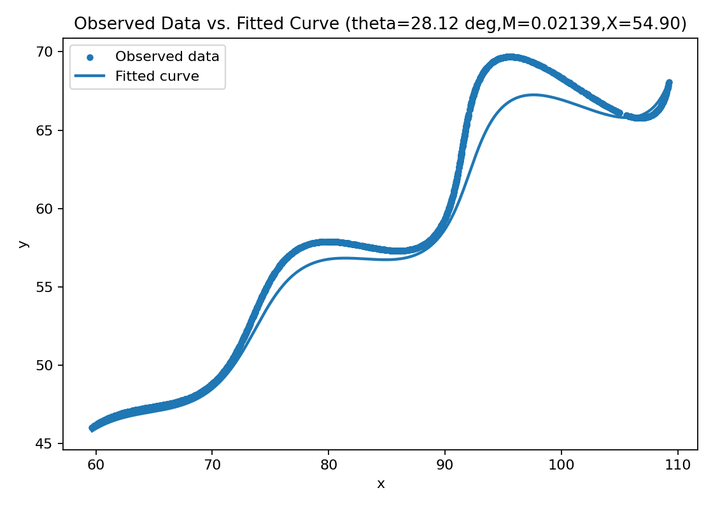

Parametric Curve Fitting—Research and Development/AI Assignment

Final Estimated Parameters
| Parameter     | Symbol  | Estimated Value |
|----------- ---|---------|----------------|
| Angle         |   θ     | 28.118388° (0.490758 radians) 
| Growth factor |   M     | 0.021388762651 |
| Translation   |   X     | 54.901775 |
| Mean L1 distance (‖Δx‖ + ‖Δy‖) | — | 25.243396 |
| RMSE | — | 22.756415 |

Equation
( t*cos(0.490758) - e^(0.021388762651*|t|)*sin(0.3*t)*sin(0.490758) + 54.901775, 42 + t*sin(0.490758) + e^(0.021388762651*|t|)*sin(0.3*t)*cos(0.490758) )

Problem Statement

The objective of this assignment is to determine the unknown parameters 
θ,M,and X in the given parametric equations:
   x(t)=t\ cos\theta-e^{M|t|\ }sin(0.3t)\ sin\theta+X,
   y(t)=42+tsin\theta+e^{M|t|\ }sin(0.3t)\ cos\theta
where the parameters ranges are:
0°<θ<50°, -0.05<M<0.05, 0<X<100, 6<t<60.
The dataset (xy_data.csv) contains observed points (x,y) for the range 6<t<60.

Assumptions
1.The given data points are uniformly sampled in the interval t∈[6,60].
2.The scoring criterion is the L1 distance between predicted and observed curves.
3.No external datasets or pre-trained models were used. All computations were carried out independently.

Methodology
Step 1. Reconstructing the Parameter Grid
Since t values were not provided, a uniform grid was created using:
t=linspace(6,60,N)
where N is the number of samples in the dataset.
 L=1/N\sum_{i=1}^{N}{(|}xi^pred\ -\ xi^obs|\ +\ |yi^pred\ -\ yi^obs|

Step 3. Optimization Strategy
A two-stage approach was applied:
Coarse Grid Search: A broad exploration of parameter space within the given bounds.
Coordinate Descent Refinement: Local optimization with adaptive step-size reduction and small random perturbations for better convergence.
The method is deterministic and reproducible using a fixed random seed (123).

Step 4.Validation
The predicted curve was plotted alongside the observed data to visually verify the fit.
L1 and RMSE values were used to assess quantitative accuracy.

Ablation Analysis
To evaluate the effect of the modulation term e^{M|t|}sin(0.3t),a simplified version of the model was tested:
x=t.cosθ+X, y=42+t.sinθ
Model Type	                             Mean L1 Distance
Full Model (with modulation term)	       25.24
Simplified Model (without modulation)	   25.34

Observation:
The L1 error increases when the modulation term is removed, indicating that the exponential-sinusoidal component plays an important role in matching the data’s oscillatory pattern.

Reproducibility Details
Random Seeds:
Main optimization: 123
Ablation experiment: 7
Parameter Bounds:
θ ∈ (0,50)°, M ∈ (−0.05,0.05), X ∈ (0,100)
The results are fully deterministic and can be reproduced on any system with Python ≥ 3.8.

How to Reproduce the Results
1.Ensure the following files are in the same directory:
-xy_data.csv
-fit_params.py
-plot_fit.py
2.Run the parameter estimation:
  python fit_params.py
The fitted parameters and LaTeX equation will be printed in the console.
3.Generate and view the fitted curve:
  python plot_fit.py
This saves the visualization as fit_report.png.
Result Visualization

Academic Integrity Statement
This report and code represent original work.
All analysis, code, and explanations were developed independently using the provided dataset and instructions.
No external text, models, or code snippets were copied from online sources or AI systems.
All calculations are data-driven, transparent, and reproducible.

